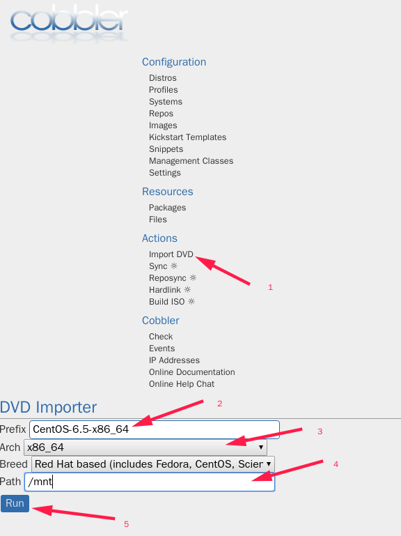

# Cobbler 批量装机

> 这是一个运行在docker里的cobbler平台。

### 使用说明
1. 启动容器
   ```
   docker run -itd \
      --name cobbler \
      --net host \
      -v /mnt:/mnt \
      -e ROOT_PASSWORD="China123" \
      -e PXE_TITLE="Hello Cobbler" \
      -e SERVER_IP="192.168.88.10" \
      -e DHCP_SUBNET="192.168.88.0" \
      -e DHCP_MASK="255.255.255.0" \
      -e DHCP_ROUTER="192.168.88.1" \
      -e DHCP_RANGE="192.168.88.200 192.168.88.230" \
      -e DHCP_DNS="223.5.5.5" \
      liujinbao3000/cobbler:latest
   ```
1. 变量
   变量|解释
   -|-
   SERVER_IP|cobbler服务器的IP
   ROOT_PASSWORD|安装系统后root用户的密码
   DHCP_RANGE|PXE引导的IP范围
   DHCP_SUBNET|PXE引导的网段
   DHCP_ROUTER|PXE引导的网关
   DHCP_DNS|PXE引导的DNS
2. 访问cobbler_web
   https://127.0.0.1/cobbler_web
   用户名:`cobbler`密码:`cobbler`
3. 访问容器
   ```
   docker exec it cobbler bash
   ```
4. 示例
   1. 挂载ISO
      ```
      sudo mount CentOS-6.5-x86_64-bin-DVD1.iso /mnt
      ```
   2. 导入cobbler (确定容器的/mnt下有ISO里的文件,有时需要重启容器才有)
      1. Import DVD
      1. Prefix:CentOS-6.5-x86_64
      1. Arch:x86_64
      1. Breed:Red Hat based(includes Fedora,CentOS,...) 
      1. Path:/mnt
      1. Run
      
   3. Centos7虚拟机内存要大于2G,不然报错,物理机未试
